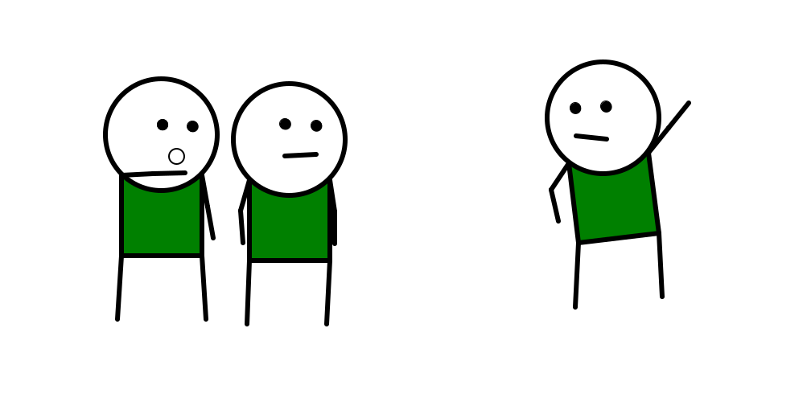
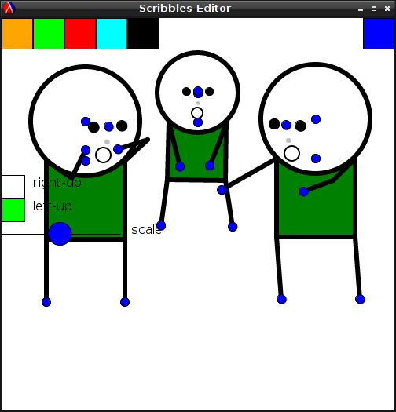

# Scribbles

Drawing with Racket!

This project is in the prototype stage. You should check back in a few months if it looks interesting!

The basic idea of this project is to mimic the kinds of drawings that a human can make if they have with computer tools. You can look at a webcomic like [The Order of the Stick](http://www.giantitp.com/comics/oots0001.html) if you want to see the art style I'm currently heading towards.

This project is not to generate such images from scratch, but rather provide a high-level interface to let a human do so:

Obviously, the final product will be much more polished than the current version.

If you want, you can also read [the development blog](http://www.colbyskeggs.com/blog).

## Trying it out

To try out this project:

 * Clone [this git repository](https://github.com/col6y/scribbles.git).
 * Install the [Racket](http://racket-lang.org/) programming language.
 * Run the main file from the command line:

        racket main.rkt

 * Poke around at the controls.
 * Realize that this isn't a polished tool and it's not be usable for anything at the moment.

# Licensing

I plan to add a real license if this ever gets out of the prototype stage.
